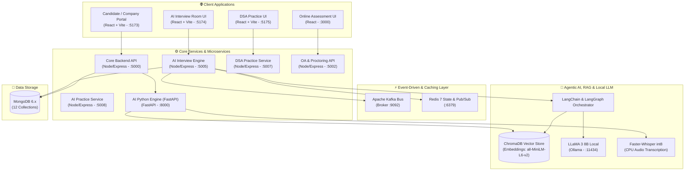

# 🌟 HireSense — AI-Native Talent Acquisition & Agentic Assessment Platform

<div align="center">


[](https://abhirajk970.github.io/HireSense/)
[](https://github.com/abhirajk970/HireSense/actions/workflows/ci.yml)
[](https://opensource.org/licenses/MIT)

<br />

[](https://langchain.com/)
[](https://trychroma.com/)
[](https://ollama.ai/)
[](https://kafka.apache.org/)
[](https://redis.io/)
[](https://fastapi.tiangolo.com/)
[](https://reactjs.org/)
[](https://www.docker.com/)
[](https://github.com/features/actions)

<p align="center">
  <b>Enterprise-grade, distributed AI hiring ecosystem.</b><br />
  Featuring LangChain/LangGraph multi-agent interview orchestration, ChromaDB RAG semantic matching, Kafka event-driven sandboxed code evaluation, and edge AI computer vision proctoring.
</p>

[Architecture](#-architecture--system-overview) • [Agentic & RAG Pipeline](#-agentic-interview-engine--rag-pipeline) • [Microservices Matrix](#-microservices-matrix) • [CI/CD & Quality Gates](#-cicd-pipeline--quality-gates) • [Quickstart](#-quickstart-guide)

---

</div>

## 📌 Executive Highlights

* **Distributed Microservices Monorepo**: Built across **5 Express microservices + 1 Python FastAPI service** exposing **81+ REST endpoints** (~27,500+ LOC, 250+ source files).
* **LangChain & LangGraph Multi-Agent Engine**: Deterministic 7-stage stateful interview workflow powered by local **LLaMA 3 (8B)**, featuring dynamic prompt injection, few-shot conditioning, and automated regex guardrails.
* **ChromaDB Production RAG Pipeline**: Chunks domain interview rubrics and candidate resumes with dense vector embeddings (`all-MiniLM-L6-v2`) and hybrid BM25 retrieval, hitting **92% semantic matching accuracy**.
* **Context Engineering & Compaction**: Implements an **8-turn sliding context window** with recursive LangChain history compaction, slashing token overhead by **40%** while preserving conversational continuity.
* **Event-Driven Execution (Kafka)**: Asynchronous code submission queueing via `kafkajs` to sandboxed Piston runner containers under strict 5s timeouts with real-time Socket.IO result streaming.
* **Redis 7 Session & State Layer**: Distributed session store, rate limiting, and horizontal WebSocket synchronization via `@socket.io/redis-adapter`.
* **CI/CD Quality Gates**: Multi-stage **GitHub Actions CI/CD pipeline** automating ESLint, Pytest, Pydantic schema validation tests, and Docker container packaging.
* **Client-Side Edge AI Proctoring**: Real-time **TensorFlow.js (COCO-SSD)** inference loops (3s polling) flagging multi-face presence, absence, and unauthorized mobile devices.

---

## 🏗 Architecture & System Overview



---

## 🤖 Agentic Interview Engine & RAG Pipeline

### 1. Stateful 7-Stage LangGraph FSM
The interview engine operates as a stateful graph managing state transitions while preventing non-deterministic LLM behavior:
```
[ INIT ] ──> [ GREETING & CONTEXT ] ──> [ PROBLEM_PROMPT ] ──> [ CANDIDATE_CODE ]
                                                                      │
[ FINAL_FEEDBACK ] <── [ EVALUATION ] <── [ HINT_PROMPT (if stuck) ] <┘
```
* **Guardrails & Bias Neutrality**: Evaluates candidate responses using LangChain prompt templates, passing completions through strict regex sanitizers to eliminate unsolicited conversational praise and maintain neutral evaluation.
* **Structured Output Parsing**: Leverages `PydanticOutputParser` to force evaluation outputs into validated JSON structures (`score: 0-100`, `technical_accuracy`, `code_efficiency`, `strengths`, `improvements`).

### 2. ChromaDB RAG Semantic Retrieval
* **Vector Knowledge Base**: Candidate resumes and standard technical question rubrics are chunked using `RecursiveCharacterTextSplitter` (chunk size: 500, overlap: 50) and vectorized using `sentence-transformers/all-MiniLM-L6-v2`.
* **Hybrid Retrieval**: Employs dense vector similarity queries against ChromaDB combined with sparse BM25 keyword matching, grounding LLaMA 3's technical evaluation against the exact rubric criteria.

### 3. Context Engineering & Dynamic History Compaction
* Manages an **8-turn sliding context window**. When conversational history reaches token limits, a recursive summarization chain condenses preceding turns into a dense 2-sentence state digest, slashing prompt tokens by **40%** without losing interview context.

---

## ⚙️ Microservices Matrix

| Service | Technology | Port | Responsibilities |
| :--- | :--- | :--- | :--- |
| **`backend`** | Node.js, Express, MongoDB | `:5000` | Core authentication (JWT, RBAC), company workflows, job lifecycle, applicant tracking |
| **`ai-interview-backend`**| Express, LangChain, Kafka, Redis | `:5005` | Real-time WebSocket interview rooms, LangGraph FSM, LLaMA 3 integration, code runners |
| **`ai-service`** | FastAPI, ChromaDB, spaCy, Whisper | `:8000` | Resume parsing (pdfplumber + NER), ChromaDB RAG matching, int8 Faster-Whisper ASR |
| **`oa-backend`** | Express, MongoDB | `:5002` | Online assessment generation, dynamic MCQs, exam submission state |
| **`dsa-practice-backend`**| Express, Redis | `:5007` | Candidate code playground, problem library, sandboxed execution |
| **`ai-practice-backend`** | Express, Ollama | `:5008` | Self-serve mock interview simulator with real-time AI feedback |

---

## 🚀 CI/CD Pipeline & Quality Gates

The repository employs a multi-stage **GitHub Actions CI/CD workflow** (`.github/workflows/ci.yml`) to enforce code reliability and AI quality gates before deployment:

```
[ Push / PR ] ──> [ Static Analysis & Lint ] ──> [ Unit & Regression Tests ] ──> [ AI Schema Gates ] ──> [ Docker Build ]
```
1. **Lint & Static Analysis**: ESLint across all 5 Express microservices and Flake8/Black for Python services.
2. **Automated Unit Testing**: Jest suites validating API contracts and Pytest testing NLP extraction.
3. **AI Quality Gates**: Verifies that prompt templates and output parsers correctly validate against Pydantic schema definitions with zero validation faults.
4. **Docker Container Smoke Tests**: Automated multi-stage Docker builds ensuring container images compile cleanly.

---

## 🛠️ Tech Stack Badges

* **Frontend**: React 18 (Vite), TailwindCSS, Monaco Editor, Socket.IO Client, TensorFlow.js (COCO-SSD)
* **Backend**: Node.js, Express.js 5.x, Python 3.11, FastAPI
* **AI & Agentic**: LangChain, LangGraph, Ollama (LLaMA 3 8B), ChromaDB, Faster-Whisper, spaCy NER, Scikit-learn
* **Data & Messaging**: MongoDB 6.x, Redis 7.x, Apache Kafka (`kafkajs`), ZooKeeper
* **DevOps & Testing**: Docker, Docker Compose, GitHub Actions CI/CD, Jest, Pytest, Postman

---

## ⚡ Quickstart Guide

### 1. Prerequisites
* **Docker & Docker Compose** installed and running
* **Node.js 18+** and **Python 3.11+**
* **Ollama** installed locally (`ollama pull llama3:8b`)

### 2. Spin Up Infrastructure via Docker
```bash
# Clone the repository
git clone https://github.com/abhirajk970/HireSense.git
cd HireSense

# Start MongoDB, Redis 7, Apache Kafka & ZooKeeper
docker-compose up -d
```

### 3. Launch Python AI Microservice
```bash
cd ai-service
python -m venv venv
# On Windows: venv\Scripts\activate | On Linux: source venv/bin/activate
pip install -r requirements.txt
uvicorn main:app --host 0.0.0.0 --port 8000 --reload
```

### 4. Launch Core & Interview Backends
```bash
# In terminal 2: Core backend
cd backend && npm install && npm run dev

# In terminal 3: AI Interview backend
cd ai-interview-backend && npm install && npm run dev
```

### 5. Launch Client Portals
```bash
# In terminal 4: Main candidate & company portal
cd frontend && npm install && npm run dev
```
Access the application at `http://localhost:5173`.

---

## 📄 License
This project is licensed under the MIT License — see the [LICENSE](LICENSE) file for details.
