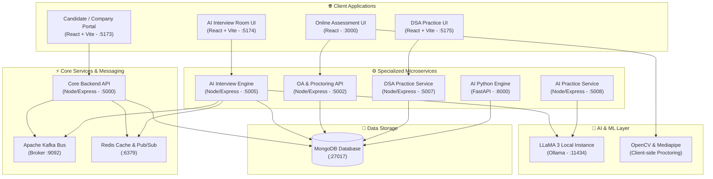

# 🌟 HireSense — Next-Gen AI Talent Acquisition & Autonomous Interview Platform

<div align="center">


[](https://abhirajk970.github.io/HireSense/)
[](https://opensource.org/licenses/MIT)

<br />

[](https://reactjs.org/)
[](https://nodejs.org/)
[](https://python.org/)
[](https://fastapi.tiangolo.com/)
[](https://ollama.ai/)
[](https://kafka.apache.org/)
[](https://redis.io/)
[](https://mongodb.com/)
[](https://www.docker.com/)

<p align="center">
  <b>An end-to-end, microservices-driven talent acquisition ecosystem.</b><br />
  Streamlining resume screening, anti-cheat proctored assessments, AI practice playgrounds, and autonomous conversational technical interviews powered by local LLaMA 3.
</p>

[Explore Live Docs](https://abhirajk970.github.io/HireSense/) • [Architecture](#-architecture--system-overview) • [Services Matrix](#-microservices-matrix) • [Quickstart](#-quickstart-guide) • [API Reference](#-key-api-endpoints)

---

</div>

## 📌 Table of Contents

- [Overview](#-overview)
- [Key Features & Capabilities](#-key-features--capabilities)
- [Architecture & System Overview](#-architecture--system-overview)
- [Microservices Matrix](#-microservices-matrix)
- [Repository Structure](#-repository-structure)
- [Quickstart Guide](#-quickstart-guide)
  - [Prerequisites](#1-prerequisites)
  - [Infrastructure Setup (Docker)](#2-spin-up-infrastructure-via-docker)
  - [Local AI Setup (Ollama)](#3-setup-local-llama-3-model)
  - [Environment Configuration](#4-configure-environment-variables)
  - [Launching the Services](#5-start-the-services)
- [Key API Endpoints](#-key-api-endpoints)
- [AI Engine & Proctoring Pipeline](#-ai-engine--proctoring-pipeline)
- [Contributing](#-contributing)
- [License](#-license)

---

## 💡 Overview

**HireSense** reimagines technical recruitment by eliminating hiring bias, cutting recruiter turnaround time by 80%, and providing candidates with an interactive, transparent interview experience. 

Built using a resilient, event-driven microservices architecture backed by **Apache Kafka** and **Redis**, HireSense handles every stage of the talent pipeline:
1. **Intelligent Sourcing**: Automated resume parsing, semantic embedding matching against JDs, and dynamic candidate scoring.
2. **Proctored Online Assessment (OA)**: Secure anti-cheat environments with computer-vision gaze and face tracking.
3. **Autonomous Technical Interviews**: Interactive LLaMA-powered DSA & Leadership Principle (LP) interviews with voice interaction, code execution sandboxes, dynamic hints, and automated evaluation scorecards.
4. **Candidate Practice Arenas**: Self-paced DSA playgrounds and mock interview simulators for continuous preparation.

---

## ✨ Key Features & Capabilities

<table>
  <tr>
    <td width="50%" valign="top">
      <h3>🤖 Autonomous AI Interviewer</h3>
      <ul>
        <li><b>Local LLaMA 3 Engine:</b> Runs private, zero-latency conversational interviews via local Ollama.</li>
        <li><b>Multi-Stage Evaluation:</b> Handles both Leadership Principles (LP) and Live Coding / DSA rounds.</li>
        <li><b>Interactive Notebook:</b> Real-time syntax highlighting, scratchpad, code runner sandbox, and AI hints.</li>
        <li><b>Audio & Speech Synthesis:</b> Real-time speech-to-text transcription and voice responses.</li>
      </ul>
    </td>
    <td width="50%" valign="top">
      <h3>🛡️ AI-Proctored Online Assessments</h3>
      <ul>
        <li><b>Computer Vision Anti-Cheat:</b> Real-time face tracking, head-pose estimation, multiple face detection, and gaze monitoring.</li>
        <li><b>Full-Screen & Tab Lock:</b> Instant flagging and logging of tab-switching or devtools access.</li>
        <li><b>Dynamic MCQ Generation:</b> Auto-generates specialized question sets tailored to job descriptions.</li>
      </ul>
    </td>
  </tr>
  <tr>
    <td width="50%" valign="top">
      <h3>📊 Multi-Role Dashboards</h3>
      <ul>
        <li><b>Candidate Portal:</b> Browse jobs, track application lifecycles, take tests, and review offer letters.</li>
        <li><b>Recruiter & Company Hub:</b> Post vacancies, inspect AI scorecards, auto-filter resumes, and manage hiring pipelines.</li>
        <li><b>Interviewer Dashboard:</b> Review AI interview recordings, code submissions, and rubric scores.</li>
      </ul>
    </td>
    <td width="50%" valign="top">
      <h3>⚡ Event-Driven Infrastructure</h3>
      <ul>
        <li><b>Apache Kafka:</b> High-throughput distributed message bus for interview events and async code evaluation.</li>
        <li><b>Redis 7:</b> In-memory state store for live interview rooms, rate-limiting, and Pub/Sub notifications.</li>
        <li><b>Dockerized Topology:</b> One-command deployment for Kafka, Zookeeper, Redis, and MongoDB.</li>
      </ul>
    </td>
  </tr>
</table>

---

## 🏗 Architecture & System Overview

HireSense decouples client interfaces, application business logic, event streaming, and AI inference engines:



---

## 📦 Microservices Matrix

| Service | Directory | Tech Stack | Default Port | Description |
|---|---|---|---|---|
| **Core Portal Frontend** | `frontend/` | React 18, Tailwind CSS, Lucide | `5173` | Candidate, Company, and Interviewer unified portals |
| **Core Backend API** | `backend/` | Node.js, Express, Mongoose, Kafka | `5000` | Auth, Job postings, Applications, Profiles, Cron scheduler |
| **AI Interview UI** | `ai-interview-frontend/` | React 18, Monaco Editor, Lucide | `5174` | Specialized interactive interview room with AI avatar & voice |
| **AI Interview Backend** | `ai-interview-backend/` | Node.js, Express, Ollama SDK, Redis | `5005` | Real-time interview orchestrator, hints engine, rubric grader |
| **AI Practice Frontend** | `ai-practice-frontend/` | React 18, Vite, Tailwind CSS | `5175` | Standalone AI coding practice simulator |
| **AI Practice Backend** | `ai-practice-backend/` | Node.js, Express, Mongoose | `5008` | Practice session state and feedback engine |
| **DSA Practice Backend** | `dsa-practice-backend/` | Node.js, Express, Mongoose | `5007` | Curated coding problems catalog and solver APIs |
| **Online Assessment UI** | `oa-frontend/` | React, WebRTC, MediaPipe | `3000` | Secure candidate testing interface with live proctoring |
| **Online Assessment API** | `oa-backend/` | Node.js, Express, MongoDB | `5002` | Test scheduling, invitation tokens, anti-cheat audit logs |
| **AI Processing Service** | `ai-service/` | Python 3.9+, FastAPI, PyTorch | `8000` | Resume vector embeddings, JD semantic parsing, auto-MCQs |
| **Infrastructure Stack** | `docker-compose.yml` | Kafka, Zookeeper, Redis 7, MongoDB 6 | `9092, 6379, 27017` | Local containerized dependencies |

---

## 📁 Repository Structure

```
HireSense/
├── ai-interview-backend/       # Autonomous AI interview orchestrator & LLM engine
│   ├── models/                 # AI interview session models & rubrics
│   ├── routes/                 # Interview and transcription endpoints
│   ├── services/               # LLaMA client, interviewEngine, Kafka & Redis
│   └── workers/                # Async code execution sandboxes
├── ai-interview-frontend/      # Interactive AI interview room (Notebook, Avatar, Chat)
├── ai-practice-backend/        # Practice session evaluation service
├── ai-practice-frontend/       # Dedicated candidate practice playground
├── ai-service/                 # Python FastAPI service for NLP & Resume analytics
├── backend/                    # Core REST API (Auth, Jobs, Applications, Interviewers)
│   ├── models/                 # Mongoose schemas (User, Job, Application, Interview)
│   ├── routes/                 # REST API endpoints & route handlers
│   └── services/               # Kafka producers/consumers & Redis caching
├── dsa-practice-backend/       # Problem sets, questions catalog, and seeders
├── frontend/                   # Main portal (Candidate & Recruiter Dashboards)
│   └── src/
│       ├── components/         # Reusable UI widgets & modals
│       └── pages/              # CandidateDashboard, CompanyDashboard, ProblemSolver
├── oa-backend/                 # Online assessment API & invitation system
├── oa-frontend/                # Proctored candidate test environment
├── interview prep/             # Interactive technical prep handbook
├── docs/                       # Live GitHub Pages technical documentation
├── docker-compose.yml          # Container services: Kafka, Zookeeper, Redis, Mongo
└── README.md                   # Project documentation
```

---

## 🚀 Quickstart Guide

### 1. Prerequisites

Make sure you have the following installed on your system:
- **Node.js** (v18.x or higher) & `npm`
- **Python** (v3.9 or higher) & `pip`
- **Docker** & **Docker Compose**
- **Ollama** ([Download here](https://ollama.ai/))

---

### 2. Spin Up Infrastructure via Docker

Start Kafka, Zookeeper, Redis, and MongoDB in detached mode:

```bash
docker-compose up -d
```

Verify that all 4 containers are healthy:
```bash
docker-compose ps
```

---

### 3. Setup Local LLaMA 3 Model

Ensure Ollama is running and download the **LLaMA 3** model:

```bash
# Pull and start LLaMA 3
ollama pull llama3
ollama run llama3
```
*The AI Interview microservice will automatically communicate with Ollama on `http://localhost:11434`.*

---

### 4. Configure Environment Variables

Create `.env` files in the backend directories based on their requirements:

#### `backend/.env`
```env
PORT=5000
MONGO_URI=mongodb://localhost:27017/hiresense
JWT_SECRET=your_super_secret_jwt_key
REDIS_URL=redis://localhost:6379
KAFKA_BROKER=localhost:9092
```

#### `ai-interview-backend/.env`
```env
PORT=5005
MONGO_URI=mongodb://localhost:27017/hiresense
OLLAMA_BASE_URL=http://localhost:11434
REDIS_URL=redis://localhost:6379
KAFKA_BROKER=localhost:9092
```

---

### 5. Start the Services

#### Step 5A: Core Backend & Main Frontend
```bash
# Terminal 1 - Core Backend API
cd backend
npm install
npm run dev

# Terminal 2 - Main Frontend Portal
cd frontend
npm install
npm run dev
```

#### Step 5B: AI Interview Microservice
```bash
# Terminal 3 - AI Interview Engine
cd ai-interview-backend
npm install
npm run dev

# Terminal 4 - AI Interview UI
cd ai-interview-frontend
npm install
npm run dev
```

#### Step 5C: AI NLP Python Service (Optional for Resume Matching)
```bash
# Terminal 5 - Python AI Service
cd ai-service
python -m venv venv
# On Windows:
.\venv\Scripts\activate
# On Linux/macOS:
source venv/bin/activate
pip install -r requirements.txt
uvicorn main:app --reload --port 8000
```

---

## 🔌 Key API Endpoints

### 🔐 Core Backend (`http://localhost:5000/api`)

| Method | Endpoint | Description |
|---|---|---|
| `POST` | `/auth/register` | Register new Candidate / Recruiter / Interviewer |
| `POST` | `/auth/login` | Authenticate user & receive JWT token |
| `GET` | `/jobs` | Retrieve all active job openings |
| `POST` | `/jobs` | Post a new job requisition (Recruiter) |
| `POST` | `/applications/apply/:jobId` | Submit application with resume & details |
| `GET` | `/interviews/my-interviews` | Retrieve scheduled interview sessions |
| `GET` | `/interviewers/stats` | Retrieve interviewer scorecard metrics |

### 🤖 AI Interview Service (`http://localhost:5005/api/ai-interview`)

| Method | Endpoint | Description |
|---|---|---|
| `POST` | `/start` | Initialize a new AI interview session |
| `POST` | `/next-stage` | Progress candidate from LP round to Coding round |
| `POST` | `/respond` | Send candidate answer / code to LLaMA 3 engine |
| `POST` | `/execute` | Run candidate code against test cases in sandbox |
| `POST` | `/finish` | Conclude interview and generate AI evaluation rubric |
| `GET` | `/report/:sessionId` | Retrieve comprehensive evaluation report & scores |

### 🧩 DSA & Practice Services (`http://localhost:5007/api`)

| Method | Endpoint | Description |
|---|---|---|
| `GET` | `/practice/questions` | List available DSA practice problems |
| `GET` | `/practice/question/:id` | Fetch problem description, starter code & constraints |
| `POST` | `/practice/submit` | Submit solution for execution & validation |

---

## 🛡️ AI Engine & Proctoring Pipeline

HireSense integrates a multi-stage proctoring pipeline:

```
                  ┌────────────────────────────────────────────────┐
                  │          Candidate Video & Audio Stream        │
                  └───────────────────────┬────────────────────────┘
                                          │
                   ┌──────────────────────┴──────────────────────┐
                   ▼                                             ▼
       ┌────────────────────────┐                   ┌────────────────────────┐
       │   Computer Vision ML   │                   │    Audio Transcription │
       ├────────────────────────┤                   ├────────────────────────┤
       │ • Face Detection       │                   │ • Voice-to-Text Stream │
       │ • Gaze Angle Tracking  │                   │ • Speech Fluency Check │
       │ • Multiple Face Alert  │                   │ • Background Noise Flag│
       └───────────┬────────────┘                   └───────────┬────────────┘
                   │                                             │
                   └──────────────────────┬──────────────────────┘
                                          ▼
                      ┌──────────────────────────────────────┐
                      │    Real-time Anti-Cheat Scorecard    │
                      │  (Aggregated in Session Audit Log)   │
                      └──────────────────────────────────────┘
```

---

## 🤝 Contributing

We welcome contributions from the community! To get started:

1. **Fork the repository** on GitHub.
2. **Create a feature branch**:
   ```bash
   git checkout -b feature/amazing-feature
   ```
3. **Commit your changes**:
   ```bash
   git commit -m "feat: add amazing feature"
   ```
4. **Push to branch**:
   ```bash
   git push origin feature/amazing-feature
   ```
5. **Open a Pull Request**.

---

## 📄 License

Distributed under the **MIT License**. See [`LICENSE`](LICENSE) for more details.

---

<div align="center">
  <sub>Built with ❤️ by the HireSense Engineering Team. Visit the <a href="https://abhirajk970.github.io/HireSense/">Official Documentation Site</a> for full architectural deep-dives.</sub>
</div>
